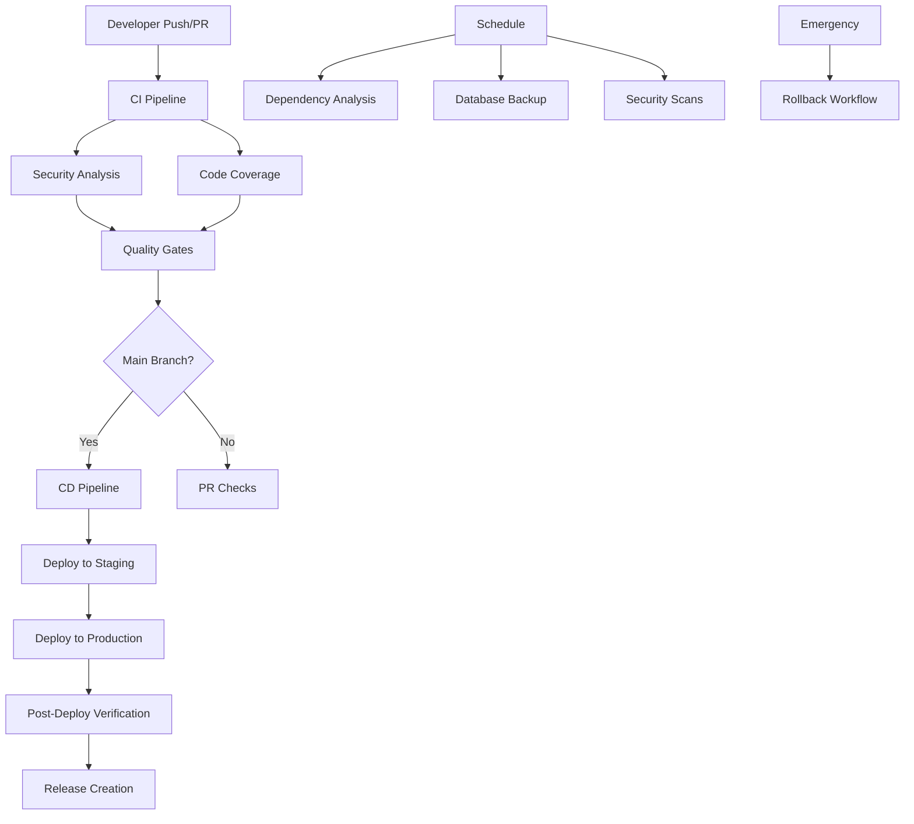

# FacePay CI/CD Pipeline Documentation

## Overview

This document provides comprehensive documentation for the complete CI/CD pipeline implemented for the FacePay project. The pipeline includes automated testing, security analysis, deployment, monitoring, and maintenance workflows.

## Architecture



## Workflows Overview

| Workflow | Trigger | Purpose | Frequency |
|----------|---------|---------|-----------|
| **CI** | Push/PR | Tests, linting, type checking | Every push |
| **CD** | Main push/Release | Deployment to production | On main changes |
| **Security** | Push/PR/Schedule | Security analysis (SAST) | Every push + daily |
| **Release** | Main push | Semantic versioning & release | On main push |
| **Dependency Analysis** | Schedule | Analyze dependencies | Weekly |
| **Database Backup** | Schedule | Backup database | Daily |
| **Coverage** | Push/PR/Schedule | Code coverage analysis | Every push + weekly |
| **Rollback** | Manual | Emergency rollback | On-demand |
| **Branch Protection** | Manual | Setup branch rules | One-time setup |

## Detailed Workflow Documentation

### 1. CI Pipeline (`ci.yml`)

**Purpose**: Continuous Integration with comprehensive quality checks

**Triggers**:
- Push to main, develop, agent/*, feature/*, hotfix/* branches
- Pull requests to main, develop

**Jobs**:
1. **Setup Dependencies**: Install and cache npm dependencies
2. **Lint**: ESLint and Prettier formatting checks
3. **Type Check**: TypeScript type validation
4. **Build**: Application build verification
5. **Unit Tests**: Complete test suite execution
6. **Critical Tests**: High-priority test paths
7. **Quality Gate**: Overall pipeline validation
8. **Notify**: Status notifications

**Required Environment Variables**:
```bash
NEXTAUTH_SECRET=<auth-secret>
NEXTAUTH_URL=<auth-url>
```

**Optional Secrets**:
```bash
CODECOV_TOKEN=<codecov-token>  # For coverage reporting
SLACK_WEBHOOK_URL=<slack-url>  # For notifications
```

**Success Criteria**:
- All linting rules pass
- No TypeScript errors
- Build completes successfully
- All tests pass (>= 90% for critical paths)
- Coverage meets minimum thresholds

### 2. CD Pipeline (`cd.yml`)

**Purpose**: Continuous Deployment to staging and production environments

**Triggers**:
- Push to main branch (staging deployment)
- Release published (production deployment)
- Manual workflow dispatch

**Jobs**:
1. **Pre-deployment Checks**: Validate deployment conditions
2. **CI Checks**: Run full CI pipeline (unless skipped)
3. **Build for Deployment**: Create deployment artifacts
4. **Deploy to Vercel**: Primary deployment platform
5. **Deploy to Netlify**: Backup deployment (optional)
6. **Database Migration**: Run Prisma migrations
7. **Smoke Tests**: Post-deployment verification
8. **Setup Rollback**: Prepare rollback information
9. **Notify**: Deployment status notifications

**Required Secrets**:
```bash
VERCEL_TOKEN=<vercel-token>
VERCEL_ORG_ID=<vercel-org-id>
VERCEL_PROJECT_ID=<vercel-project-id>
DATABASE_URL=<database-connection-string>
```

**Optional Secrets**:
```bash
NETLIFY_AUTH_TOKEN=<netlify-token>  # For backup deployment
NETLIFY_SITE_ID=<netlify-site-id>
SLACK_WEBHOOK_URL=<slack-webhook>   # For notifications
DISCORD_WEBHOOK=<discord-webhook>   # For notifications
```

**Environments**:
- **staging**: Automatic deployment from main branch
- **production**: Manual approval required
- **production-db**: Database migration environment

### 3. Security Analysis (`security.yml`)

**Purpose**: Comprehensive security analysis and vulnerability detection

**Triggers**:
- Push to main, develop branches
- Pull requests to main, develop
- Daily schedule (2 AM UTC)
- Manual workflow dispatch

**Jobs**:
1. **CodeQL Analysis**: GitHub's semantic code analysis
2. **Dependency Vulnerability Scan**: npm audit for vulnerabilities
3. **Snyk Security Scan**: Professional security scanning (optional)
4. **ESLint Security Rules**: Security-focused linting
5. **Secrets Detection**: TruffleHog secrets scanning
6. **License Compliance**: License compatibility checking
7. **Docker Security**: Container vulnerability scanning (optional)
8. **Security Summary**: Comprehensive security report
9. **Security Notification**: Alert on critical issues

**Required Permissions**:
```yaml
permissions:
  actions: read
  contents: read
  security-events: write
```

**Optional Secrets**:
```bash
SNYK_TOKEN=<snyk-token>  # For professional scanning
SLACK_WEBHOOK_URL=<slack-webhook>  # For critical alerts
```

**Security Thresholds**:
- **Critical vulnerabilities**: 0 allowed
- **High vulnerabilities**: 0 allowed
- **Moderate vulnerabilities**: Review required
- **License violations**: Configurable list of prohibited licenses

### 4. Semantic Release (`release.yml`)

**Purpose**: Automated semantic versioning and release management

**Triggers**:
- Push to main branch
- Manual workflow dispatch

**Jobs**:
1. **Analyze Commits**: Determine release version using conventional commits
2. **Build Release Artifacts**: Create release builds and archives
3. **Update Documentation**: Update version badges and API docs
4. **Deploy to Production**: Trigger production deployment
5. **Create GitHub Milestone**: Set up next version milestone
6. **Security Scan Release**: Validate release security
7. **Performance Baseline**: Establish performance metrics
8. **Notify Release**: Comprehensive release notifications
9. **Setup Rollback Info**: Prepare rollback procedures

**Commit Convention**:
```
feat: new feature (minor version bump)
fix: bug fix (patch version bump)
BREAKING CHANGE: breaking change (major version bump)
docs: documentation changes (patch version bump)
test: test additions (patch version bump)
chore: maintenance (patch version bump)
```

**Release Artifacts**:
- Source code archive
- Built application archive
- Release notes
- Rollback information

**Optional Secrets**:
```bash
LHCI_GITHUB_APP_TOKEN=<lighthouse-token>  # For performance testing
SLACK_WEBHOOK_URL=<slack-webhook>  # For release notifications
```

### 5. Dependency Analysis (`dependency-analysis.yml`)

**Purpose**: Comprehensive dependency management and analysis

**Triggers**:
- Weekly schedule (Sundays at 3 AM UTC)
- Changes to package.json or package-lock.json
- Manual workflow dispatch

**Jobs**:
1. **Dependency Tree Analysis**: Analyze dependency structure
2. **Outdated Dependencies Check**: Identify update opportunities
3. **License Compliance Analysis**: Deep license scanning
4. **Security Deep Scan**: Enhanced security analysis
5. **Performance Impact Analysis**: Bundle size and performance impact
6. **Generate Summary Report**: Comprehensive analysis summary
7. **Notify Results**: Alert on critical issues

**Analysis Outputs**:
- Dependency tree visualization
- Outdated packages report
- License compliance report
- Security vulnerability report
- Performance impact assessment
- Update recommendations

### 6. Database Backup (`database-backup.yml`)

**Purpose**: Automated database backup and maintenance

**Triggers**:
- Daily schedule (2 AM UTC) - incremental backup
- Weekly schedule (Sundays at 1 AM UTC) - full backup
- Manual workflow dispatch

**Jobs**:
1. **Pre-backup Health Check**: Verify database connectivity
2. **Create Database Backup**: Generate backup files
3. **Verify Backup Integrity**: Validate backup quality
4. **Store Backup Securely**: Upload to cloud storage
5. **Database Maintenance**: Cleanup and optimization
6. **Cleanup Old Backups**: Remove expired backups
7. **Generate Backup Report**: Backup status and metrics
8. **Notify Backup Status**: Alert on backup failures

**Backup Types**:
- **Incremental**: Daily changes (last 24 hours)
- **Full**: Complete database dump
- **Schema-only**: Structure without data

**Required Secrets**:
```bash
DATABASE_URL=<database-connection>
```

**Optional Secrets** (for cloud storage):
```bash
AWS_ACCESS_KEY_ID=<aws-key>
AWS_SECRET_ACCESS_KEY=<aws-secret>
BACKUP_BUCKET=<s3-bucket-name>

# OR for Google Cloud
GCP_SA_KEY=<service-account-key>
GCP_PROJECT_ID=<project-id>

# OR for Azure
AZURE_STORAGE_ACCOUNT=<account-name>
AZURE_STORAGE_KEY=<account-key>
```

### 7. Code Coverage (`coverage.yml`)

**Purpose**: Code coverage analysis and quality metrics

**Triggers**:
- Push to main, develop branches
- Pull requests to main, develop
- Weekly schedule (Sundays at 4 AM UTC)
- Manual workflow dispatch

**Jobs**:
1. **Generate Code Coverage**: Create comprehensive coverage reports
2. **Critical Path Coverage**: Focus on high-priority code paths
3. **Coverage Diff Analysis**: Compare PR coverage changes (PR only)
4. **Uncovered Lines Analysis**: Identify gaps in test coverage
5. **Coverage Quality Gates**: Enforce minimum coverage standards
6. **Generate Coverage Report**: Comprehensive coverage documentation
7. **Track Coverage Trends**: Long-term coverage monitoring
8. **Notify Coverage Status**: Alert on coverage changes

**Coverage Thresholds**:
- **Minimum acceptable**: 70%
- **Good coverage**: 80%
- **Excellent coverage**: 90%
- **Critical paths**: 85% minimum

**Required Secrets**:
```bash
CODECOV_TOKEN=<codecov-token>  # For coverage reporting
```

### 8. Emergency Rollback (`rollback.yml`)

**Purpose**: Emergency production rollback capabilities

**Triggers**:
- Manual workflow dispatch only

**Input Parameters**:
- **rollback_target**: previous_release | specific_commit | last_known_good
- **target_commit**: Specific commit SHA (if needed)
- **rollback_reason**: Required description
- **skip_tests**: Emergency bypass option
- **notify_team**: Team notification toggle

**Jobs**:
1. **Validate Rollback Request**: Verify rollback target and permissions
2. **Create Rollback Branch**: Prepare rollback branch
3. **Rollback Tests**: Run critical tests (unless skipped)
4. **Prepare DB Rollback**: Create pre-rollback database backup
5. **Deploy Rollback**: Execute rollback deployment
6. **Post-Rollback Verification**: Verify rollback success
7. **Update Production References**: Update main branch references
8. **Create Rollback Documentation**: Generate incident reports
9. **Notify Team**: Emergency notifications

**Safety Features**:
- Admin-only execution
- Comprehensive validation
- Pre-rollback database backup
- Rollback verification
- Complete audit trail
- Emergency notification system

### 9. Branch Protection Setup (`setup-branch-protection.yml`)

**Purpose**: Configure repository branch protection rules

**Triggers**:
- Manual workflow dispatch only

**Configured Protection Rules**:

**Main Branch**:
- 2+ approving reviews required
- Dismiss stale reviews
- Require code owner reviews
- All status checks must pass
- Conversation resolution required
- Linear history enforced
- No force pushes or deletions

**Develop Branch**:
- 1+ approving review required
- Dismiss stale reviews
- CI tests must pass
- Conversation resolution required
- No force pushes or deletions

**Additional Configurations**:
- CODEOWNERS file creation
- Repository settings optimization
- Merge strategy configuration

## Environment Setup

### Required GitHub Secrets

#### Core Secrets (Required)
```bash
# Authentication
NEXTAUTH_SECRET=<your-nextauth-secret>
NEXTAUTH_URL=<your-application-url>

# Database
DATABASE_URL=<your-database-connection-string>

# Deployment (Vercel)
VERCEL_TOKEN=<your-vercel-token>
VERCEL_ORG_ID=<your-vercel-org-id>
VERCEL_PROJECT_ID=<your-vercel-project-id>
```

#### Optional Secrets (Enhanced Features)
```bash
# Code Coverage
CODECOV_TOKEN=<your-codecov-token>

# Security Scanning
SNYK_TOKEN=<your-snyk-token>

# Notifications
SLACK_WEBHOOK_URL=<your-slack-webhook>
DISCORD_WEBHOOK=<your-discord-webhook>
SLACK_EMERGENCY_WEBHOOK_URL=<emergency-slack-webhook>
DISCORD_EMERGENCY_WEBHOOK=<emergency-discord-webhook>

# Alternative Deployment (Netlify)
NETLIFY_AUTH_TOKEN=<your-netlify-token>
NETLIFY_SITE_ID=<your-netlify-site-id>

# Performance Testing
LHCI_GITHUB_APP_TOKEN=<lighthouse-ci-token>

# Cloud Storage (Choose one)
# AWS S3
AWS_ACCESS_KEY_ID=<aws-access-key>
AWS_SECRET_ACCESS_KEY=<aws-secret>
BACKUP_BUCKET=<s3-bucket-name>

# Google Cloud Storage
GCP_SA_KEY=<service-account-key-json>
GCP_PROJECT_ID=<gcp-project-id>

# Azure Blob Storage
AZURE_STORAGE_ACCOUNT=<storage-account>
AZURE_STORAGE_KEY=<storage-key>

# Email Notifications
EMAIL_USERNAME=<smtp-username>
EMAIL_PASSWORD=<smtp-password>
```

### GitHub Environments

Create the following GitHub environments with appropriate protection rules:

1. **staging**: Automatic deployment environment
2. **production**: Manual approval required
3. **production-db**: Database operations environment
4. **production-rollback**: Emergency rollback environment

## Monitoring and Alerting

### Dashboard Links

After setup, monitor your pipelines through:

- **GitHub Actions**: Repository → Actions tab
- **Codecov**: https://codecov.io/gh/[owner]/[repo]
- **Vercel Dashboard**: https://vercel.com/dashboard
- **Dependency Dashboard**: Dependabot PRs and security alerts

### Key Metrics to Monitor

1. **Pipeline Success Rate**: % of successful CI/CD runs
2. **Deployment Frequency**: How often you deploy to production
3. **Lead Time**: Time from commit to production
4. **Mean Time to Recovery**: Time to recover from failures
5. **Test Coverage**: Overall and critical path coverage
6. **Security Vulnerabilities**: Number and severity of issues
7. **Dependency Freshness**: Outdated package count

### Alerting Channels

Configure notifications for:
- **Critical Failures**: Production deployment failures, security alerts
- **Coverage Drops**: Significant decreases in test coverage
- **Dependency Issues**: Critical vulnerabilities, license violations
- **Backup Failures**: Database backup or verification failures

## Best Practices

### For Developers

1. **Commit Messages**: Use conventional commit format
2. **Branch Naming**: Use feature/, bugfix/, hotfix/ prefixes
3. **Pull Requests**: Keep focused and include tests
4. **Code Reviews**: Address feedback promptly and thoroughly
5. **Testing**: Maintain test coverage above minimum thresholds

### For DevOps/CI Maintenance

1. **Secret Rotation**: Regularly rotate authentication tokens
2. **Workflow Updates**: Keep actions and dependencies updated
3. **Monitoring**: Review pipeline metrics and failure patterns
4. **Documentation**: Keep this documentation current
5. **Incident Response**: Have rollback procedures ready

### Security Considerations

1. **Least Privilege**: Grant minimum necessary permissions
2. **Secret Management**: Use GitHub Secrets, never commit sensitive data
3. **Dependency Updates**: Keep dependencies current via Dependabot
4. **Security Scanning**: Address vulnerabilities promptly
5. **Access Controls**: Limit who can trigger critical workflows

## Troubleshooting

### Common Issues

#### CI Pipeline Failures
1. **Linting Errors**: Run `npm run lint:fix` locally
2. **Type Errors**: Run `npm run type-check` and fix issues
3. **Test Failures**: Run `npm test` locally and debug
4. **Build Failures**: Check for missing environment variables

#### Deployment Issues
1. **Vercel Deployment Fails**: Check Vercel token and project configuration
2. **Database Migration Fails**: Verify DATABASE_URL and migration files
3. **Health Checks Fail**: Ensure application starts correctly

#### Security Scan Issues
1. **High Vulnerabilities**: Update dependencies or add security patches
2. **License Violations**: Replace packages with compatible licenses
3. **Secrets Detected**: Remove secrets and rotate exposed credentials

#### Coverage Issues
1. **Low Coverage**: Add tests for uncovered code paths
2. **Coverage Drops**: Ensure new code includes adequate tests
3. **Critical Path Coverage**: Focus on high-priority functionality

### Getting Help

1. **Check Logs**: Review GitHub Actions workflow logs
2. **Documentation**: Refer to this guide and linked resources
3. **Issues**: Create GitHub issues for persistent problems
4. **Team Communication**: Use configured notification channels

## Maintenance Schedule

### Weekly Tasks
- Review Dependabot PRs and security alerts
- Check pipeline success rates and failure patterns
- Review code coverage trends
- Update any outdated workflow dependencies

### Monthly Tasks
- Rotate authentication tokens and secrets
- Review and update branch protection rules
- Analyze performance metrics and optimization opportunities
- Update documentation based on workflow changes

### Quarterly Tasks
- Comprehensive security audit of CI/CD pipeline
- Review and optimize resource usage
- Update disaster recovery and rollback procedures
- Team training on new features or process changes

## Conclusion

This CI/CD pipeline provides comprehensive automation for the FacePay project, covering:

✅ **Quality Assurance**: Automated testing, linting, and type checking
✅ **Security**: Vulnerability scanning, secrets detection, and license compliance
✅ **Deployment**: Automated staging and production deployments
✅ **Monitoring**: Code coverage, performance metrics, and health checks
✅ **Maintenance**: Dependency updates, database backups, and cleanup
✅ **Emergency Response**: Rollback procedures and incident management
✅ **Documentation**: Comprehensive guides and automated reporting

The pipeline is designed to be:
- **Secure**: Multiple layers of security scanning and validation
- **Reliable**: Comprehensive testing and validation at each stage
- **Fast**: Optimized for quick feedback and deployment
- **Maintainable**: Clear documentation and automated maintenance
- **Scalable**: Can be extended for additional environments and features

For questions, issues, or improvements, please refer to the repository's issue tracker or contact the development team through the configured notification channels.

---

*Last Updated: $(date)*
*Version: 1.0.0*