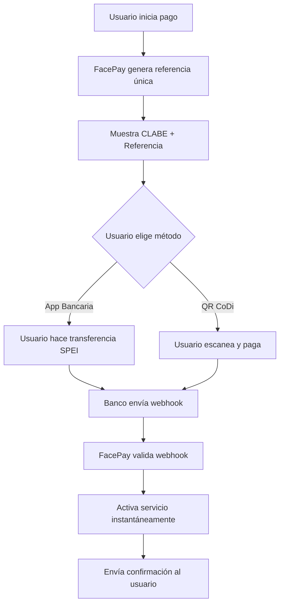

# 📘 Guía Completa: Implementación SPEI Directo en FacePay

## ✅ Requisitos Legales (100% Legal)

### 1. Documentación Necesaria
- **RFC** con actividad empresarial
- **Acta Constitutiva** (si es persona moral)
- **Comprobante de domicilio** fiscal
- **Identificación oficial** del representante legal
- **FIEL** (Firma Electrónica) activa

### 2. Cuenta Bancaria Empresarial
Necesitas abrir una cuenta de negocio en uno de estos bancos:

| Banco | Costo Mensual | API Disponible | Webhooks | Tiempo Setup |
|-------|---------------|----------------|----------|--------------|
| **BBVA** | $0-299 MXN | ✅ Sí | ✅ Sí | 5-7 días |
| **Santander** | $199 MXN | ✅ Sí | ✅ Sí | 7-10 días |
| **Banorte** | $250 MXN | ✅ Sí | ⚠️ Limitado | 10-15 días |
| **Citibanamex** | $300 MXN | ⚠️ Beta | ❌ No | 15-20 días |
| **HSBC** | $400 MXN | ✅ Sí | ✅ Sí | 10-15 días |

### 3. Activación de Servicios

#### Paso 1: Abrir Cuenta Empresarial
```
1. Ir a sucursal con documentación
2. Solicitar cuenta "Empresarial Digital" o "PyME"
3. Activar banca en línea empresarial
4. Solicitar token físico o digital
```

#### Paso 2: Activar API/Webhooks
```
1. Entrar a portal empresarial del banco
2. Sección "Desarrolladores" o "APIs"
3. Generar credenciales API
4. Configurar IP whitelist
5. Configurar webhook URLs
```

## 💰 Estructura de Costos REAL

### Costos Fijos Mensuales
- Cuenta empresarial: $200-400 MXN/mes
- Certificado SSL (si no usas Vercel): $0-50 USD/año
- Hosting webhook receiver: $0 (incluido en Vercel)

### Costos por Transacción
- **SPEI entrada** (cliente te paga): $0 MXN
- **SPEI salida** (tú pagas): $5-8 MXN
- **Consulta de saldo API**: $0.10-0.50 MXN

### Comparación con MercadoPago
```
Venta de $100 MXN:

MercadoPago: $100 - 3.49% = $96.51 (pierdes $3.49)
SPEI Directo: $100 - $0 = $100.00 (no pierdes nada)

Venta de $1,000 MXN:
MercadoPago: $1,000 - 3.49% = $965.10 (pierdes $34.90)
SPEI Directo: $1,000 - $0 = $1,000 (no pierdes nada)
```

## 🔧 Implementación Técnica

### 1. Configurar Variables de Entorno
```env
# SPEI Configuration
BANK_NAME=BBVA
BANK_API_KEY=pk_live_xxxxxxxxxxxx
BANK_API_SECRET=sk_live_xxxxxxxxxxxx
COMPANY_CLABE=012180015643278901
BANK_WEBHOOK_SECRET=whsec_xxxxxxxxxxxx
SPEI_ENVIRONMENT=production

# Your Company Info
COMPANY_NAME="FacePay México SA de CV"
COMPANY_RFC=FPM230815XX0
```

### 2. Crear Endpoint para Recibir Webhooks
```typescript
// app/api/webhooks/spei/route.ts
import { SPEIService } from '@/lib/spei-direct';

export async function POST(request: Request) {
  const body = await request.json();
  const headers = request.headers;
  
  const speiService = new SPEIService({
    bankName: process.env.BANK_NAME as any,
    apiKey: process.env.BANK_API_KEY!,
    apiSecret: process.env.BANK_API_SECRET!,
    clabe: process.env.COMPANY_CLABE!,
    webhookSecret: process.env.BANK_WEBHOOK_SECRET!,
    environment: 'production'
  });
  
  try {
    await speiService.handleWebhook(headers, body);
    
    // Activar servicio para el usuario
    if (body.status === 'completed') {
      // Update payment in database
      // Activate user service
      // Send confirmation
    }
    
    return Response.json({ received: true });
  } catch (error) {
    return Response.json({ error: 'Invalid webhook' }, { status: 400 });
  }
}
```

### 3. Flujo de Pago Completo



## 🚀 Proceso de Implementación (2 semanas)

### Semana 1: Setup Legal y Bancario
- [ ] Día 1-2: Preparar documentación
- [ ] Día 3: Abrir cuenta empresarial en BBVA
- [ ] Día 4-5: Activar banca en línea
- [ ] Día 6-7: Solicitar acceso a APIs

### Semana 2: Implementación Técnica
- [ ] Día 8: Configurar credenciales API
- [ ] Día 9: Implementar webhook receiver
- [ ] Día 10: Crear UI para mostrar CLABE/QR
- [ ] Día 11: Testing en sandbox
- [ ] Día 12: Migración a producción
- [ ] Día 13-14: Testing con pagos reales pequeños

## ⚠️ Consideraciones Importantes

### Ventajas
✅ 0% comisión en pagos recibidos
✅ Liquidación instantánea 24/7
✅ Sin riesgo de chargebacks
✅ Total control sobre el proceso
✅ Mejor para pagos B2B y montos grandes

### Desventajas
❌ Usuario debe abrir app bancaria (fricción)
❌ No hay pagos recurrentes automáticos
❌ No funciona con tarjetas internacionales
❌ Requiere cuenta bancaria mexicana
❌ Más complejo que un simple checkout

### Recomendación Híbrida
```
< $50 MXN → No aceptar (no vale la pena)
$50-500 MXN → SPEI/CoDi (0% comisión)
> $500 MXN → Ofrecer ambos (SPEI y MercadoPago)
Internacional → Solo MercadoPago/Stripe
```

## 📞 Contactos Bancarios para APIs

### BBVA
- Portal: https://www.bbva.mx/empresas/productos/canales-digitales/apis.html
- Email: api.market@bbva.com
- Teléfono: 55 5226 2663

### Santander
- Portal: https://www.santander.com.mx/empresas/soluciones-digitales/
- Email: openbanking@santander.com.mx
- Teléfono: 55 5169 4300

### Banorte
- Portal: https://www.banorte.com/apis
- Email: apis@banorte.com
- Teléfono: 55 5140 5600

## 🎯 Próximos Pasos

1. **Decidir banco** (recomiendo BBVA por mejor API)
2. **Abrir cuenta empresarial** esta semana
3. **Mientras tanto**, implementar el código base
4. **Hacer pruebas** con tu cuenta personal primero
5. **Lanzar beta** con usuarios selectos

¿Preguntas? El SPEI directo es 100% legal, usado por todas las fintechs mexicanas grandes (Clip, Konfío, Klar, etc.).